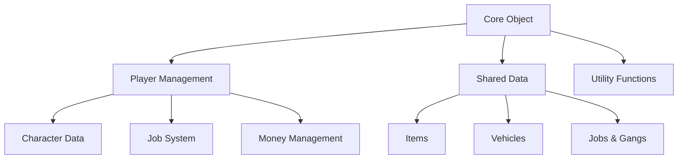

# Core Framework Overview

The QBCore Framework is built around several core components that work together to provide a comprehensive roleplay experience. This section covers the fundamental building blocks that every QBCore developer should understand.

## Architecture Overview

QBCore follows a modular architecture with these key components:



## Core Components

### 1. Core Object
The [Core Object](/docs/core/core-object) is the central hub that provides access to all framework functionality. It's your main entry point for interacting with QBCore.

**Key Features:**
- Player management functions
- Access to shared data
- Utility functions
- Command registration

### 2. Player Data
[Player Data](/docs/core/player-data) contains all information about a player character, including personal info, job, money, items, and metadata.

**Structure:**
- Character information (name, DOB, etc.)
- Job and gang affiliations
- Money (cash, bank, crypto)
- Inventory items
- Metadata (hunger, thirst, stress)

### 3. Shared Data
Shared data contains configuration information that's accessible from both client and server sides.

**Includes:**
- Items configuration
- Vehicle data
- Jobs and gangs
- Weapons information

## Getting Started

### Basic Setup

Every QBCore resource starts with accessing the core object:

```lua
-- Server-side
local QBCore = exports['qb-core']:GetCoreObject()

-- Client-side
local QBCore = exports['qb-core']:GetCoreObject()
```

### Player Interaction Example

```lua
-- Server-side: Handle player interaction
RegisterNetEvent('myresource:doSomething', function()
    local src = source
    local Player = QBCore.Functions.GetPlayer(src)
    
    if not Player then
        return -- Player not found
    end
    
    -- Check if player has required job
    if Player.PlayerData.job.name == "police" then
        -- Perform police-specific action
        Player.Functions.AddMoney("bank", 1000, "police-bonus")
        TriggerClientEvent('QBCore:Notify', src, 'Police bonus received!', 'success')
    end
end)
```

### Item Management Example

```lua
-- Give player an item
local Player = QBCore.Functions.GetPlayer(source)
Player.Functions.AddItem("water_bottle", 1, false, {quality = 100})

-- Check if player has item
local hasItem = Player.Functions.GetItemByName("water_bottle")
if hasItem then
    print("Player has water bottle")
end
```

## Framework Features

### Player Management
- **Character Creation**: Multi-character support
- **Data Persistence**: Automatic saving to database
- **Session Management**: Handle joins/leaves
- **Permission System**: Admin/user permissions

### Job System
- **Dynamic Jobs**: Easy job switching
- **Grade System**: Hierarchical job structures
- **Duty Status**: On/off duty mechanics
- **Boss Actions**: Management capabilities

### Economy
- **Multiple Currencies**: Cash, bank, crypto
- **Transaction Logging**: All money changes tracked
- **Item Economy**: Complex item system
- **Business Integration**: Shop and business support

### Communication
- **Event System**: Client/server communication
- **Callback System**: Request/response patterns
- **Notification System**: User feedback
- **Command System**: Chat commands

## Best Practices

### 1. Always Validate Input
```lua
-- Good
local amount = tonumber(args[1])
if not amount or amount <= 0 then
    return TriggerClientEvent('QBCore:Notify', src, 'Invalid amount', 'error')
end

-- Bad
local amount = args[1] -- Could be nil or non-numeric
```

### 2. Check Player Existence
```lua
-- Good
local Player = QBCore.Functions.GetPlayer(source)
if not Player then return end

-- Bad
local Player = QBCore.Functions.GetPlayer(source)
local name = Player.PlayerData.charinfo.firstname -- Can error
```

### 3. Use Appropriate Functions
```lua
-- Good - Use framework functions
Player.Functions.AddMoney("cash", 100, "salary")

-- Bad - Direct manipulation
Player.PlayerData.money.cash = Player.PlayerData.money.cash + 100
```

### 4. Handle Errors Gracefully
```lua
-- Good
local success = Player.Functions.RemoveMoney("cash", 100, "purchase")
if success then
    -- Continue with purchase
else
    TriggerClientEvent('QBCore:Notify', src, 'Insufficient funds', 'error')
end
```

## Resource Structure

A typical QBCore resource follows this structure:

```
myresource/
├── fxmanifest.lua
├── server/
│   ├── main.lua
│   └── callbacks.lua
├── client/
│   ├── main.lua
│   └── functions.lua
├── shared/
│   └── config.lua
└── html/
    ├── index.html
    ├── style.css
    └── script.js
```

### Example fxmanifest.lua
```lua
fx_version 'cerulean'
game 'gta5'

description 'My QBCore Resource'
author 'Your Name'
version '1.0.0'

shared_scripts {
    'shared/config.lua'
}

client_scripts {
    'client/main.lua',
    'client/functions.lua'
}

server_scripts {
    'server/main.lua',
    'server/callbacks.lua'
}

ui_page 'html/index.html'

files {
    'html/index.html',
    'html/style.css',
    'html/script.js'
}

dependencies {
    'qb-core'
}
```

## Database Integration

QBCore uses MySQL for data persistence. Common operations:

```lua
-- Using MySQL-Async (recommended)
MySQL.Async.execute('INSERT INTO player_data (citizenid, data) VALUES (?, ?)', {
    Player.PlayerData.citizenid,
    json.encode(someData)
})

-- Fetching data
MySQL.Async.fetchAll('SELECT * FROM player_data WHERE citizenid = ?', {
    Player.PlayerData.citizenid
}, function(result)
    if result[1] then
        -- Process result
    end
end)
```

## Event System

QBCore provides several built-in events:

### Server Events
- `QBCore:Server:PlayerLoaded` - Player joined and loaded
- `QBCore:Server:OnPlayerUnload` - Player left server
- `QBCore:Server:OnJobUpdate` - Player job changed
- `QBCore:Server:OnGangUpdate` - Player gang changed

### Client Events
- `QBCore:Client:OnPlayerLoaded` - Local player loaded
- `QBCore:Client:OnPlayerUnload` - Local player unloaded
- `QBCore:Client:OnJobUpdate` - Job changed
- `QBCore:Client:SetDuty` - Duty status changed

## Configuration

QBCore configuration is stored in `qb-core/shared/config.lua`:

```lua
QBConfig = {}

-- Server settings
QBConfig.MaxPlayers = GetConvarInt('sv_maxclients', 48)
QBConfig.DefaultSpawn = vector4(-1035.71, -2731.87, 12.86, 0.0)

-- Money settings
QBConfig.Money = {
    MoneyTypes = {'cash', 'bank', 'crypto'},
    DontAllowMinus = {'cash', 'crypto'},
    PayCheckTimeOut = 10,
    PayCheckSociety = false
}

-- Player settings
QBConfig.Player = {
    HungerRate = 4.2,
    ThirstRate = 3.8
}
```

## Next Steps

Now that you understand the core framework:

1. [Explore Player Data](/docs/core/player-data) - Deep dive into player structure
2. [Learn the API](/docs/api/server-functions) - Server function reference
3. [Set up Development](/docs/development/vscode-setup) - Configure your environment
4. [Browse Resources](/docs/resources) - See available QBCore resources

## Common Patterns

### Resource Initialization
```lua
local QBCore = exports['qb-core']:GetCoreObject()

-- Wait for core to be ready
CreateThread(function()
    while not QBCore do
        Wait(10)
        QBCore = exports['qb-core']:GetCoreObject()
    end
    
    -- Initialize your resource
    print("Resource loaded successfully")
end)
```

### Player Action Validation
```lua
RegisterNetEvent('myresource:action', function(data)
    local src = source
    local Player = QBCore.Functions.GetPlayer(src)
    
    -- Validation chain
    if not Player then return end
    if not data or not data.amount then return end
    if Player.PlayerData.job.name ~= "police" then return end
    
    -- Proceed with action
end)
```

This overview provides the foundation for working with QBCore. Each component has detailed documentation in their respective sections.